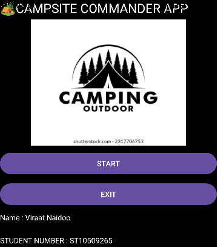
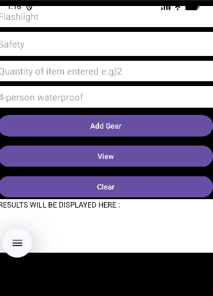
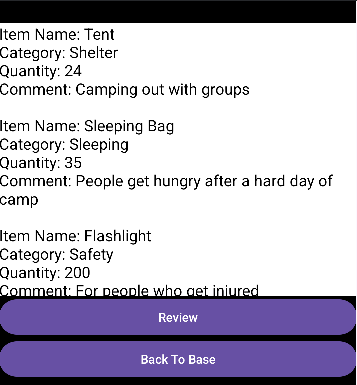
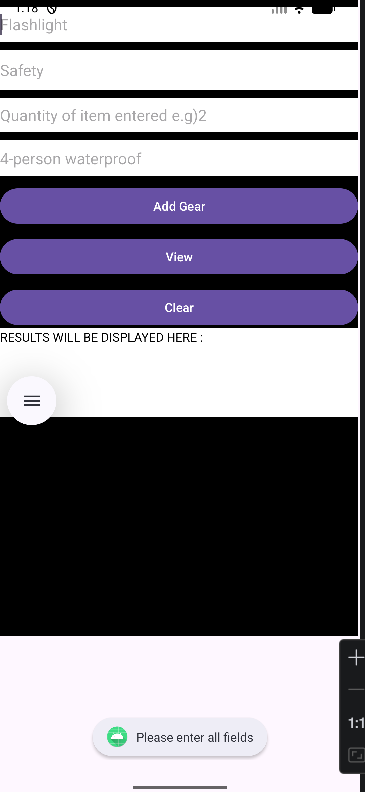
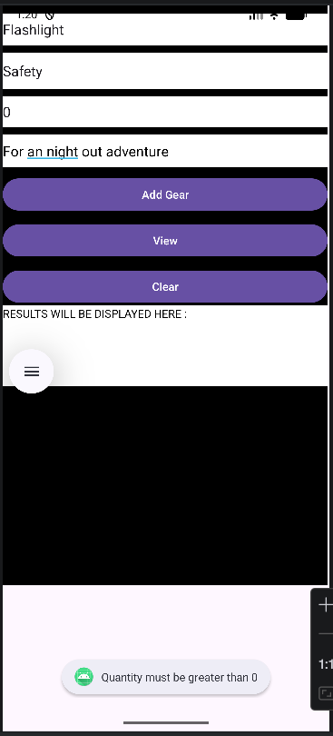

# 🏕️ Camping Gear Tracker App
# 🌐 GitHub Repository
# [Click here to view the repository](https://github.com/VNaidoo-DEV/VIRAAT_NAIDOO_IMAD_EXAM_2.git)

---
## 💻 Overview
The Camping Gear Tracker App is an Android application developed using Kotlin and Android Studio. 
The application allows users to manage a camping packing list by storing item names, categories, quantities, and comments while providing useful packing statistics and detailed item information.

---

## 🎯 Purpose

This project demonstrates:

- 💻 Kotlin programming fundamentals.
- 📁 ArrayList data storage.
- ⚙️ Activity navigation using Intents.
- Input validation and error handling.
- Functions and loops.
- User interaction handling.
- Android UI design principles.

---

## ✨ Features

### 🚀 Splash Screen
-Displays application title
-Displays student information
-Start button to enter the application
-Exit button to close the application

### 🎒 Packing List Screen

Allows users to:

- Enter Item Name
- Enter Item Category
- Enter Quantity
- Enter Comments
- Add camping gear items
- Calculate total items packed
- Clear input fields
- View detailed packing report

### 📋 Detail Screen

Displays:

- All recorded camping items
- Item categories
- Quantities
- Comments

---

## 🛡️ Error Handling

The application validates user input and displays appropriate error messages.

- Empty Fields

- Invalid Quantity Input

Validation includes:

- Empty field checks.
- Quantity validation (must be greater than 0).
- Prevention of invalid input.
- Data validation before processing.
  
## 🎥 Animations
- Smooth transitions between screens.
- Activity navigation animations.
- Improved user experience.
  
## 🛠️ Technologies Used
- 💜 Kotlin
- 💻 Android Studio
- 🎨 XML Layouts
- 📱 Android SDK
- 🐙 GitHub
- ⚡ GitHub Actions
- 🧠 Application Logic

## Arrays Used
##### private val itemNames = ArrayList<String>()
##### private val itemCategories = ArrayList<String>()
##### private val itemQuantities = ArrayList<Int>()
##### private val itemComments = ArrayList<String>()

## 🧠Logic Process
- User enters camping item details.
- Input is validated.
- Data is stored in ArrayLists.
- Loops calculate total items packed.
- Functions process validation and calculations.
- Results are displayed to the user.
- Detailed report is shown on the Detail Screen.

## ⚙️ How It Works
- Launch the application.
- Navigate from the Splash Screen to the Packing Screen.
- Enter camping item information.
- Save the item details.
- View total items packed.
- Navigate to the Detail Screen.
- Review full packing list information.

## ⚠️ Challenges & Solutions
### Challenge:

- Managing multiple ArrayLists across screens.

### Solution:

- Used Intents to pass ArrayList data between activities.

### Challenge:

- Ensuring correct total calculation.

### Solution:

- Used a loop to sum all values inside the quantity ArrayList.

### Challenge:

- Preventing invalid or empty input.

### Solution:

- Implemented input validation using conditional statements.

## 🚀 Installation
1. [Clone the repository](https://github.com/VNaidoo-DEV/VIRAAT_NAIDOO_IMAD_EXAM_2.git)
2. Open the project in Android Studio.
3. Sync Gradle files.
4. Run the application on an emulator or Android device.

## 🔮 Future Improvements
- Firebase integration.
- User accounts.
- Packing categories filtering.
- Search functionality.
- Dark mode support.
- Room Database for offline storage.

## ✅ Notes
- ArrayLists store all user input data.
- Loops are used for calculations.
- Functions improve modularity.
- Intents handle screen navigation.
- Input validation improves reliability.

## 👨🏾‍💻 Author

### Name: Viraat Naidoo

### Student Number: ST10509365

## 📜 License

This project was developed for educational purposes as part of the IMAD5112 module.
